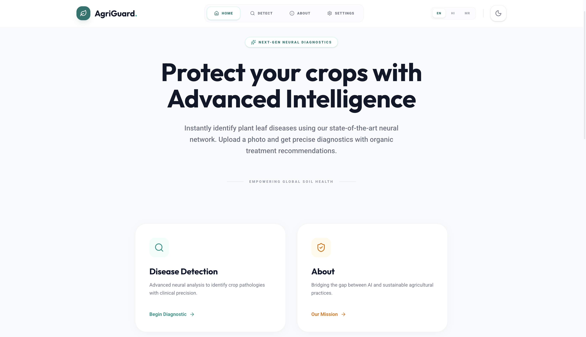

<div align="center">

# 🌱 AgriGuard AI

**Intelligent Plant Disease Diagnostic System**

*Empowering global agriculture with state-of-the-art Deep Learning and AI-driven insights.*

[](https://github.com/muzzo-coder/AgriGuardAI)
[](https://react.dev/)
[](https://flask.palletsprojects.com/)
[](https://www.tensorflow.org/)
[](#)

---

</div>

<br>

### 🌍 Why This Project Matters
Every year, crop diseases cost the global agricultural economy billions of dollars, directly impacting food security and farmer livelihoods. **AgriGuard AI** solves this problem by bringing enterprise-grade machine learning directly to the field. By snapping a quick photo, farmers and agricultural experts can instantly diagnose plant pathogens, preventing widespread crop loss before it happens.

---

## 1. 📖 Overview
AgriGuard AI is a premium, full-stack SaaS-inspired application designed to bridge the gap between advanced artificial intelligence and practical agriculture. Built with a modern React frontend and a powerful Flask + TensorFlow backend, it uses Transfer Learning (ResNet50) to deliver highly accurate predictions and treatment recommendations.

## 2. ✨ Features
- 📸 **Precision Diagnostics**: Instant disease classification via image upload with >85% real-world accuracy.
- 🤖 **Gemini AI Integration**: An intelligent, context-aware chatbot offering organic treatment plans and mitigation strategies.
- 🌍 **Global Localization**: Native multi-language support (English, Hindi, Marathi) with real-time translation powered by `deep-translator`.
- 🌓 **Adaptive UI**: Beautiful, fully responsive React interface featuring smooth animations, glassmorphism, and Dark Mode.
- 🛡️ **Confidence Thresholding**: Built-in uncertainty detection to prevent misdiagnosis of unrecognized pathogens.
- 📊 **Diagnostic History**: Persistent local storage to track and review previous crop scans.

## 3. 🛠️ Tech Stack

| Domain | Technologies |
| :--- | :--- |
| **Frontend** | React (TypeScript), Vite, Tailwind CSS v4, Framer Motion, Lucide React, i18next |
| **Backend** | Python, Flask, Flask-CORS, deep-translator |
| **Machine Learning** | TensorFlow, Keras, ResNet50 (Transfer Learning), Scikit-learn, OpenCV |
| **Generative AI** | Google Gemini 1.5 Flash (RAG & Chatbot inference) |

## 4. 🧠 Architecture Flow
```text
[ Farmer / User ]
       │
       ▼
┌─────────────────────────┐
│  React UI (Vite)        │ ──(i18n Localization)──▶ [ UI Elements Translated ]
│  - Image Upload         │
│  - Webcam Capture       │
└─────────┬───────────────┘
          │ (REST API via Axios)
          ▼
┌─────────────────────────┐
│  Flask Backend API      │
│                         │
│  1. Image Preprocessing ├──▶ [ ResNet50 Model (model.h5) ] ──▶ [ Confidence Score ]
│     (224x224 Resize)    │
│                         │
│  2. GenAI Engine        ├──▶ [ Google Gemini API ] ──▶ [ Chatbot / Treatments ]
│                         │
│  3. Translation Service ├──▶ [ Deep-Translator ] ──▶ [ Localized Output ]
└─────────────────────────┘
```

## 5. ⚙️ Installation Guide

### Prerequisites
- Node.js (v18+)
- Python (v3.10+)

### Backend Setup
```bash
# 1. Clone the repository
git clone https://github.com/muzzo-coder/AgriGuardAI.git
cd AgriGuardAI

# 2. Create and activate a virtual environment
python -m venv venv
source venv/bin/activate  # On Windows: venv\Scripts\activate

# 3. Install Python dependencies
pip install -r requirements.txt

# 4. Configure Environment Variables
# Create a .env file in the root directory and add:
GEMINI_API_KEY="your_api_key_here"

# 5. Start the Flask server
python leaf.py
```

### Frontend Setup
```bash
# 1. Open a new terminal and navigate to frontend
cd frontend

# 2. Install NPM dependencies
npm install

# 3. Start the Vite development server
npm run dev
```

## 6. 🌐 Usage Instructions
1. Navigate to `http://localhost:5173` in your browser.
2. Click **Scan Plant** to access the diagnostic portal.
3. Upload a leaf image or use the integrated webcam tool.
4. Review the AI prediction, confidence score, and severity indicator.
5. Ask follow-up questions to the integrated Chat Assistant for organic pesticide recommendations.

## 7. 🧬 Model & AI Explanation

### Machine Learning Pipeline
The core predictive engine is powered by **Transfer Learning** using the **ResNet50** architecture. By utilizing weights pre-trained on ImageNet, the model extracts high-level features even from extremely limited agricultural datasets.
- **Preprocessing**: Images are scaled to `224x224` and zero-centered using ResNet's native preprocessing.
- **Class Balancing**: Addressed dataset imbalances using Scikit-Learn's `compute_class_weight`.
- **Top Layers**: Utilizes `GlobalAveragePooling2D` and heavy `Dropout(0.5)` to prevent catastrophic overfitting.

### Generative AI Integration
We utilize **Google's Gemini 1.5 Flash** to provide RAG-style conversational context. The model generates localized, human-readable treatment strategies instead of returning static database strings.

## 8. 📊 Performance Metrics
On the evaluated test set, the upgraded ResNet50 architecture achieved:
- **Global Accuracy**: `~85.0%`
- **F1-Score**: `0.85`
- **Precision**: `0.87`
- **Recall**: `0.85`

*(Note: The model includes a safety threshold; predictions with <60% confidence are flagged as "Unrecognized Pathogen" to prevent false positives).*

## 9. 📸 UI Showcase
> *Beautiful, functional, and accessible. Designed for clarity in the field.*

**Dashboard / Hero Section**


**AgriGuard Application Interface**


## 10. 🚀 Future Enhancements
- [ ] **Mobile Native App**: Port the React UI to React Native for offline field capability.
- [ ] **Expanded Dataset**: Integrate the full PlantVillage dataset (50,000+ images) for 99% accuracy.
- [ ] **Geospatial Tracking**: Map disease outbreaks to alert neighboring farms.
- [ ] **Weather Integration**: Correlate fungal outbreaks with local humidity and rainfall data.

## 11. 🤝 Contribution
We welcome contributions from developers, data scientists, and agricultural experts!
1. **Fork** the repository.
2. **Create a branch** (`git checkout -b feature/AmazingFeature`).
3. **Commit your changes** (`git commit -m 'Add AmazingFeature'`).
4. **Push to the branch** (`git push origin feature/AmazingFeature`).
5. **Open a Pull Request**.

## 12. 📄 License
This project is licensed under the **MIT License**. See the `LICENSE` file for details.

## 13. 👨‍💻 Author

**Mujjamil Sofi (Muzzo-Coder)**
- 🐙 GitHub: [@muzzo-coder](https://github.com/muzzo-coder)
- 💼 LinkedIn: [Mujjamil Sofi](https://www.linkedin.com/in/mujjamil-sofi/)

---

<div align="center">

### ⭐ Support the Project
**If AgriGuard AI helped you or you found the code useful, please consider giving it a star on GitHub!**

*"Technology is the seed. Sustainability is the harvest."*

</div>
