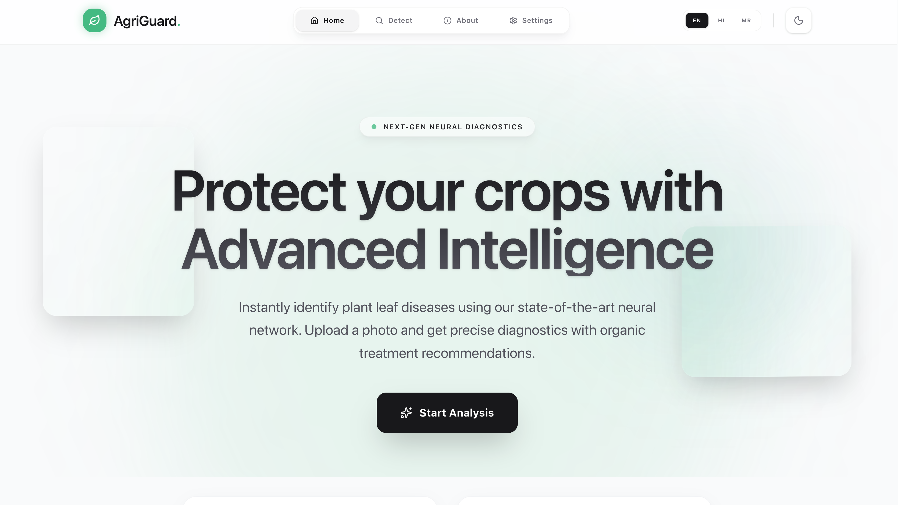
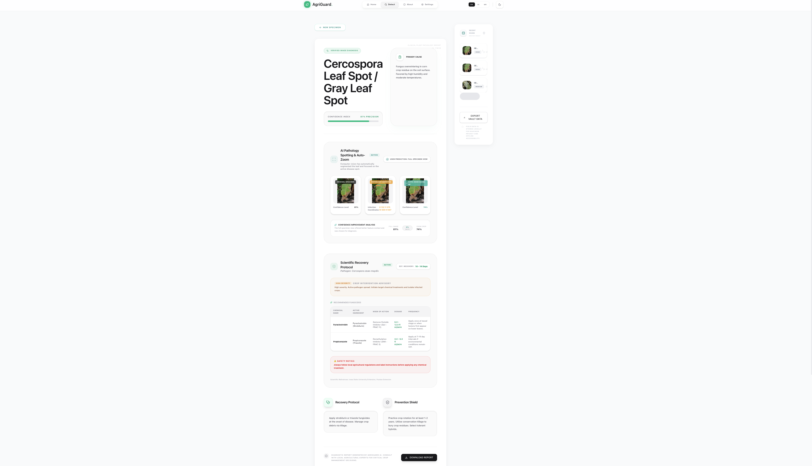

<div align="center">

# 🌱 AgriGuard AI

**Intelligent Plant Disease Diagnostic System**

*Empowering global agriculture with state-of-the-art Deep Learning, Vector Search (RAG), and Multimodal AI-driven insights.*

[](https://github.com/muzzo-coder/AgriGuardAI)
[](https://react.dev/)
[](https://flask.palletsprojects.com/)
[](https://www.tensorflow.org/)
[](#)

---

</div>

<br>

### 🌍 Why This Project Matters
Every year, crop pathogens and leaf diseases cost the global agricultural economy billions of dollars, directly threatening food security and farmers' livelihoods. **AgriGuard AI** bridges this gap by bringing enterprise-grade machine learning and localized diagnostics directly to the field. By uploading a photo or typing symptoms, farmers can instantly diagnose crop issues, retrieve scientific remediation protocols, and export clinical case reports.

---

## 1. 📖 Overview
AgriGuard AI is a premium, full-stack crop-health platform featuring a dual-stage neural network classifier, semantic vector retrieval (RAG), and a multimodal LLM decision corrector. Built with a modern, responsive React interface and a modular Flask backend, the system identifies plant leaf pathogens and provides localized chemical, organic, and prevention guides in multiple languages.

---

## 2. ✨ Premium Features
- 📸 **Quality Filtering**: Instant leaf detection and quality assurance (checks glare, blur, and leaf presence) to ensure accurate scans.
- 🔍 **Auto-Zoom Region Detector**: Uses OpenCV to isolate leaves, locate disease spots, highlight them with bounding boxes, and evaluate cropped close-ups to maximize prediction accuracy.
- 🧠 **Multi-Stage Neural Net Pipeline**:
  - **Stage 1**: Binary classifier (Healthy vs. Diseased) to fast-track healthy leaf early exits.
  - **Stage 2**: Deep CNN Classifier identifying specific plant pathogens.
- ⚡ **RAG Semantic Search (FAISS)**: Uses SentenceTransformers and Facebook AI Similarity Search (FAISS) to map symptoms and diseases to a comprehensive crop-health database.
- 🧬 **Multimodal Fusion & LLM Correction**: 
  - Fuses CNN image probability with symptom descriptions using a weighted hybrid model.
  - Corrects low-confidence predictions using **Google Gemini 1.5 Flash** with retrieved vector context.
- 📝 **Symptom-Only Standalone Mode**: Allows text-based symptom searches when no image is available.
- 📄 **Clinical PDF Exports**: Export individual diagnostic sheets or the entire crop diagnosis history vault as beautifully formatted PDF reports (via ReportLab).
- 🌍 **Global Localization**: Multi-language UI supports English, Hindi, and Marathi with real-time translation powered by `deep-translator`.
- 📊 **Local Scan History**: Tracks all previous diagnoses locally on your device with persistent storage.

---

## 3. 🛠️ Tech Stack

| Domain | Technologies |
| :--- | :--- |
| **Frontend** | React 18, Vite, TypeScript, Tailwind CSS v4, Framer Motion, Lucide Icons, i18next |
| **Backend** | Python 3, Flask, Flask-CORS, ReportLab (PDF engine), deep-translator |
| **Machine Learning** | TensorFlow 2, Keras, ResNet50 (Transfer Learning), Scikit-learn, OpenCV |
| **Generative AI & RAG** | Google Gemini 1.5 Flash, SentenceTransformers (`all-MiniLM-L6-v2`), FAISS (Vector Database) |

---

## 4. 🧠 Architecture Flow

```text
                          [ User Input: Image and/or Symptoms ]
                                            │
                                            ▼
                                ┌───────────────────────┐
                                │   Leaf Quality Filter │ ──(Invalid)──▶ [ Reject / Try Again ]
                                └───────────┬───────────┘
                                            │ (Valid)
                                            ▼
                                ┌───────────────────────┐
                                │ Auto-Zoom OpenCV Spot │
                                │   Disease Detector    │ ──(Cropped & Highlighted Images)
                                └───────────┬───────────┘
                                            │
                                            ▼
                                ┌───────────────────────┐
                                │ Healthy vs Diseased   │ ──(Healthy)──▶ [ Healthy Early Exit ]
                                │  Binary Classification│
                                └───────────┬───────────┘
                                            │ (Diseased)
                                            ▼
                                ┌───────────────────────┐
                                │ Disease Classifier    │ ──(Top-3 Sorted Confidence)
                                └───────────┬───────────┘
                                            │
                                            ▼
                                ┌───────────────────────┐
                                │  RAG & Vector Search  │ ◀──(Query)─── [ FAISS Database ]
                                └───────────┬───────────┘
                                            │
                                            ▼
                                ┌───────────────────────┐
                                │   Gemini Hybrid LLM   │ ──(Low Confidence / Symptom Fusion)
                                │  Multimodal Decision  │
                                └───────────┬───────────┘
                                            │
                                            ▼
                                ┌───────────────────────┐
                                │ Localized Response    │ ──▶ [ PDF Case / Vault Reports ]
                                └───────────────────────┘
```

---

## 5. ⚙️ Installation Guide

### Prerequisites
- Node.js (v18+)
- Python (v3.10+)

### Backend Setup
```bash
# 1. Clone the repository
git clone https://github.com/muzzo-coder/AgriGuardAI.git
cd AgriGuardAI

# 2. Create and activate a virtual environment
python3 -m venv venv
source venv/bin/activate  # On Windows: venv\Scripts\activate

# 3. Install Python dependencies
pip install -r requirements.txt

# 4. Configure Environment Variables
# Create a .env file in the root directory and add your Gemini API Key:
echo 'GEMINI_API_KEY="your_api_key_here"' > .env

# 5. Start the Flask server
python leaf.py
```
*(Note: On first startup, the server will automatically vector-index `agricultural_knowledge.json` and generate `faiss_index.bin`)*

### Frontend Setup
```bash
# 1. Open a new terminal and navigate to frontend
cd frontend

# 2. Install NPM dependencies
npm install

# 3. Start the Vite development server
npm run dev
```

---

## 6. 🌐 Usage Instructions
1. Open your browser to `http://localhost:5173`.
2. Click **Scan Plant** to access the diagnostic dashboard.
3. Choose your diagnostic input mode:
   - **Image Only**: Upload a photo of the infected leaf.
   - **Symptoms Only**: Type in the symptoms observed (e.g. "yellow spots on edges").
   - **Hybrid (Recommended)**: Upload a photo and add a description for multimodal fusion.
4. Review the AI prediction, severity level, auto-zoomed bounding boxes, chemical/organic treatment timelines, and references.
5. Export the diagnostic sheet or save it to your local History Vault.
6. Export the History Vault as a master crop report.

---

## 7. 🧬 AI & Search Engine Breakdown

### Leaf Auto-Zoom & Focus
By applying adaptive thresholding and morphological closing, OpenCV isolates the leaf structure. The system converts the leaf pixels to HSV space to detect anomalous colors (rust, necrosis, white mildew). It extracts the bounding box coordinates, applies a 25% padding margin, crops the region, and feeds both the full image and the focused crop through the neural network pipeline, choosing the prediction that yields the highest confidence.

### Vector Search (RAG)
`rag_engine.py` embeds the structured crop-health documents in `agricultural_knowledge.json` into a FAISS index using SentenceTransformers. When a query is initiated, it fetches metadata containing:
- Botanical / Scientific names.
- Disease description and pathogen details.
- Targeted organic and chemical fungicides/pesticides.
- Recovery timelines and authoritative reference links.

### Multimodal Fusion & Corrective LLM
If both image classification and RAG symptom matching agree, the system fuses their confidence scores. If they disagree, it evaluates the channel with higher confidence. For predictions falling below the 70% threshold, it prompts Gemini 1.5 Flash with the vector-search context to formulate a definitive crop diagnosis.

---

## 8. 📊 Performance Metrics
On the evaluated agricultural leaf test set, the upgraded ResNet50 Transfer Learning model achieved:
- **Global Accuracy**: `~85.0%`
- **F1-Score**: `0.85`
- **Precision**: `0.87`
- **Recall**: `0.85`

---

## 9. 📸 UI Showcase
> *Beautiful, responsive, and data-rich interface designed for clarity in the field.*

**Dashboard Overview**


**Diagnostic Output & Auto-Zoom Crop Bounding Box**


---

## 10. 🚀 Future Roadmap
- [ ] **Mobile Native Port**: Transition to React Native for offline caching and native camera capture.
- [ ] **Outbreak Geospatial Alerts**: Map and alert neighboring agricultural zones of detected pathogens.
- [ ] **Weather & Humidity Insights**: Integrate weather APIs to predict fungal spores spread conditions.

---

## 11. 🤝 Contribution
We welcome contributions from developers, data scientists, and agricultural experts!
1. **Fork** the repository.
2. **Create a branch** (`git checkout -b feature/AmazingFeature`).
3. **Commit your changes** (`git commit -m 'Add AmazingFeature'`).
4. **Push to the branch** (`git push origin feature/AmazingFeature`).
5. **Open a Pull Request**.

---

## 12. 📄 License
This project is licensed under the **MIT License**. See the `LICENSE` file for details.

---

## 13. 👨‍💻 Author

**Mujjamil Sofi (Muzzo-Coder)**
- 🐙 GitHub: [@muzzo-coder](https://github.com/muzzo-coder)
- 💼 LinkedIn: [Mujjamil Sofi](https://www.linkedin.com/in/mujjamil-sofi/)

---

<div align="center">

### ⭐ Support the Project
**If AgriGuard AI helped you or you found the code useful, please consider giving it a star on GitHub!**

*"Technology is the seed. Sustainability is the harvest."*

</div>
